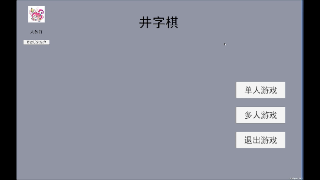

# 双人联网井字棋 Tic-Tac-Toe Online

一个基于 **Unity + Photon PUN 2** 的井字棋小游戏,支持**本地双人**与**在线实时对战**两种模式。项目重点不在玩法,而在于一套**可复用的游戏框架**:事件驱动架构、单例框架、UI 面板框架,以及基于 Photon 自定义事件的网络同步方案。

> 项目定位:个人技术展示项目,重点展示 **联网同步** 与 **代码架构** 能力。

---

## 🎮 游戏演示



---

## ✨ 功能特性

### 核心玩法
- 本地双人对战(单设备轮流落子)
- 在线实时对战(不同设备,经 Photon Cloud 同步)
- 完整的胜负 / 平局判定,支持"再来一局"

### 联网功能(Photon PUN 2)
- 连接 / 断开服务器,创建房间、加入房间、离开房间
- 通过自定义事件 `RaiseEvent` 实现落子同步
- 房间自定义属性同步"游戏开始"等状态,房主才能开始游戏
- 玩家头像与昵称的实时同步(`CustomProperties`)
- 掉线处理:对局中对方离开时自动退房

### 工程能力
-  **事件中心(EventCenter)**,逻辑与 UI 彻底解耦
- 通用 **单例框架**(`SingletonBase` / `SingletonAutoMono`)
-  **UI 面板框架**(`UIManager` + `BasePanel`,含淡入淡出)
- 玩家昵称 / 头像的 **JSON 本地存档**(`JsonUtility`)

---

## 🛠 技术栈

| 类别 | 技术 |
|------|------|
| 引擎 | Unity 2022.3 LTS(2022.3.62f3c1) |
| 语言 | C# |
| 网络 | Photon PUN 2(Photon Cloud) |
| UI | UGUI + TextMeshPro |
| 数据 | JsonUtility(JSON 本地持久化) |

---

## 🚀 如何运行

1. 使用 **Unity 2022.3 LTS** 及以上版本打开项目。
2. 打开场景 `Assets/Scenes/Main.unity`,点击 Play。

---

## 📁 项目结构

```
Assets/
├── Scenes/
│   └── Main.unity                 # 唯一场景(程序化加载 UI)
├── Scripts/
│   ├── Main.cs                    # 入口,显示主菜单
│   ├── GameMgr.cs                 # 游戏核心逻辑(落子/回合/胜负判定)
│   ├── NetworkMgr.cs              # Photon 联网管理(房间/同步/掉线)
│   ├── Cell.cs                    # 棋盘格子(订阅事件刷新 UI)
│   ├── CellUpdateData.cs          # 落子数据载体(struct)
│   ├── Data/
│   │   ├── PlayerData.cs          # 玩家数据模型
│   │   └── PlayerDataManager.cs   # 存档读写(JSON)
│   ├── Enum/                      # 各类枚举定义
│   ├── EventCenter/               # 事件中心框架
│   │   ├── EventBase.cs
│   │   ├── EventCenter.cs
│   │   └── EventObject.cs
│   ├── SingletonBase/             # 单例框架
│   │   ├── SingletonBase.cs       # 非 MonoBehaviour 单例
│   │   └── SingletonAutoMono.cs   # MonoBehaviour 单例
│   └── UI/                        # UI 面板与 UIManager
│       ├── UIManager.cs           # 面板管理(字典 + 动态加载)
│       ├── PanelBase.cs           # 面板基类(淡入淡出)
│       └── ...                    # 各业务面板
└── ArtRes/                        # 美术资源(头像等)
```

---

## 🧩 核心架构

### 1. 事件驱动(EventCenter)

游戏逻辑与 UI 通过事件中心通信,互不直接引用。例如一次落子的完整链路:

```
点击格子(Cell)
   │ 触发 EventTrigger<int>(PlayerMove)
   ▼
GameMgr.OnPlayerMove            ← 校验回合 / 更新棋盘数据
   │ 触发 EventTrigger<CellUpdateData>(CellSpriteUpdate)
   ▼
Cell.OnCellSpriteUpdate         ← 更新该格子的贴图
```

联网模式下,`GameMgr` 还会额外触发 `OnlineMyMoveSent` 事件,由 `NetworkMgr` 通过 `RaiseEvent` 发给对手,对手收到后回调 `GameMgr.ReceiveOpponentMove`——**本地与联网共用同一套落子逻辑**。

### 2. 单例框架

- `SingletonBase<T>`:通过反射调用私有构造函数实例化,适合纯 C# 管理器(`EventCenter`、`UIManager`、`PlayerDataManager`)。
- `SingletonAutoMono<T>`:自动挂载到 `DontDestroyOnLoad` 的空物体上,适合需要生命周期函数的 `MonoBehaviour`(`GameMgr`)。

### 3. 网络同步(Photon PUN 2)

- 落子同步使用 `RaiseEvent` 自定义事件 + `SendOptions.SendReliable`(可靠传输),而非 RPC,减少对 PhotonView 的依赖;
- 通过房间 `CustomProperties` 同步"游戏开始"、"头像索引"等状态;
- 处理了**制胜一步的同步时序**:无论是否结束,本地落子都会先发给对方,保证对方能收到并弹出胜负面板。

---

## 👤 作者

- GitHub:[jayjteck](https://github.com/jayjteck)
- 邮箱:299866@qq.com

---

## 📄 License

MIT License
